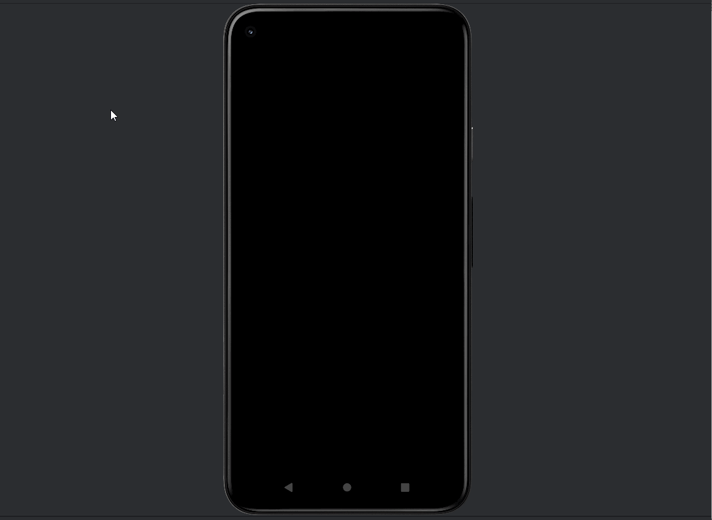

# AND101 Project 3 - AnimalApps

Submitted by: **Rahat Moktadir**

Time spent: **5** hours spent in total

## Summary

**Howlr** is an Android app that recreates a Twitter-style landing page — but built exclusively for wolves 🐺. It's a themed layout exercise using Jetpack Compose, with custom styling, a dark-mode aesthetic, and a fully custom tweet component designed for animals in the digital age. This project helped deepen my understanding of Compose layouts, theming, and design systems.

If I had to describe this project in three (3) emojis, they would be: 🌕🐾📱

## Application Features

The following REQUIRED features are completed:

- [x] Pick an app screenshot to duplicate  
  - (Inspired by the Twitter login and tweet layout)
- [x] Create a runnable app that displays an Animal Version of your chosen screenshot
- [x] Layout uses one (1) or more ConstraintLayout  
  - (Used Jetpack Compose's `Column`, equivalent to ConstraintLayout)
- [x] Layout uses one (1) or more ImageView  
  - (Used `Image()` composable with a wolf logo)
- [x] Layout uses three (3) or more TextViews  
  - (Used `Text()` for app name, tagline, call to action, and tweet content)

The following STRETCH features are implemented:

- [ ] Create a custom-shape Button using Shape Drawables
- [ ] Customize the text fonts by creating new Font Resources
- [ ] Add Tooltips to your Views to help users understand how to navigate the UI
- [ ] Create a second layout, this time for an original, personal app idea

The following EXTRA features are implemented:

- [x] Added a stylized tweet component with username, tweet text, and social actions
- [x] Customized app theme with deep night colors (#0D1117 and #121212)
- [x] Added a dark blue border around the tweet using Compose’s `border` modifier

## Chosen Screenshot

I have chosen to duplicate the following layout from the **Twitter** app:

## Video Demo

Here's a video / GIF that demos all of the app's implemented features:

GIF created with **LiceCap**

## Original App Layout (Optional Stretch Feature)

This stretch feature was not implemented in this project.

## Notes

- This was my first time building a non-XML Android layout using Jetpack Compose
- I learned how to work with composables like `Column`, `Image`, `Text`, and `Row`
- It was fun theming an app around wolves and giving it a personality
- I ran into issues with resource linking in XML early on, then successfully migrated to Compose which resolved them

## License

Copyright **2025** **Rahat Moktadir**

Licensed under the Apache License, Version 2.0 (the "License");  
you may not use this file except in compliance with the License.  
You may obtain a copy of the License at

    http://www.apache.org/licenses/LICENSE-2.0

Unless required by applicable law or agreed to in writing, software  
distributed under the License is distributed on an "AS IS" BASIS,  
WITHOUT WARRANTIES OR CONDITIONS OF ANY KIND, either express or implied.  
See the License for the specific language governing permissions and  
limitations under the License.
